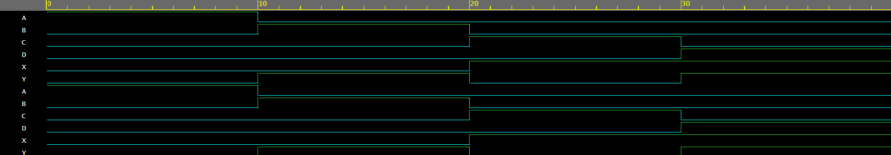

## Description

This project implements a 4:2 Encoder using Verilog HDL. The encoder converts four input lines into a 2-bit binary output. The design was verified using a testbench and waveform simulation to ensure correct functionality.
## Features
. Designed using Verilog HDL
. Implements 4-to-2 encoding logic
. Verified using a testbench
. Waveform generated and analyzed
. Useful for learning digital logic and VLSI design concepts
## Tools Used
. Verilog HDL
. EDA Playground
. EPWave / GTKWave
## Author
Manasa Mytri

